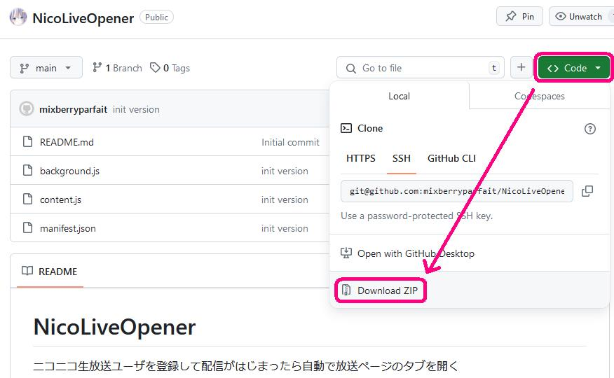
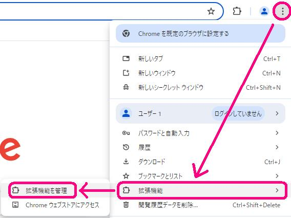
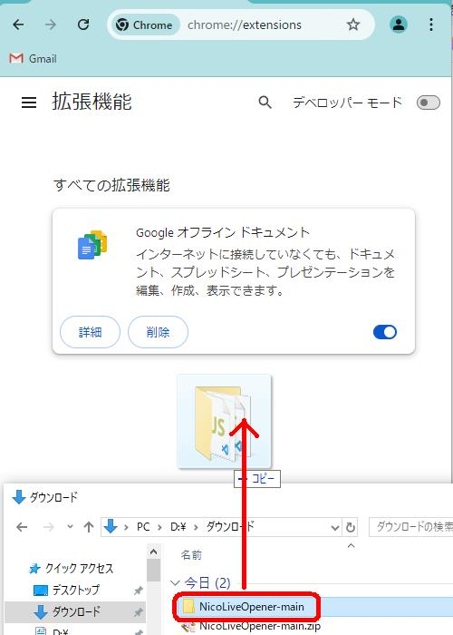
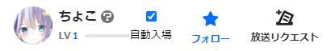

# NicoLiveOpener

ニコニコ生放送ユーザを登録して配信がはじまったら自動で放送ページのタブを開く

 

### インストール

#### 1. ダウンロード

ページ右上の Code から Download ZIP を選択 

||
|:-:|

 

#### 2. ZIP を解凍
1 でダウンロードしたZIPを解凍してフォルダにまとめる

 
  
#### 3. 拡張機能管理画面を開く

右上メニューからたどるか　URLに `chrome://extensions/` と入力

||
|:-:|

※ chrome ユーザを作ってないと拡張機能自体が使えません

 
  
#### 4. インストール

ディベロッパーモードを有効にして

エクスプローラーから 2 で解答したフォルダを拡張機能管理画面にドラッグ＆ドロップ

||
|:-:|

※ 信頼されてない開発元　みたいな警告が出ますが気になるならソース全文みれるので確認してください

需要あればウェブストアに申請するかも

 
  
### 使い方

正常にインストールができていれば、
ニコ生視聴ページの右下ユーザ名の横に自動入場チェックボックスが追加されるので、
それにチェックを入れるだけ

||
|:-:|

１分に１回ユーザページの生放送履歴APIをよんで status LIVE のものがあったらそのURLをタブで開きます

解除するにはチェックボックスのチェックを外してください

 

### 連絡

バグとか要望とかあれば

 [@mixberryparfait](https://x.com/mixberryparfait)
